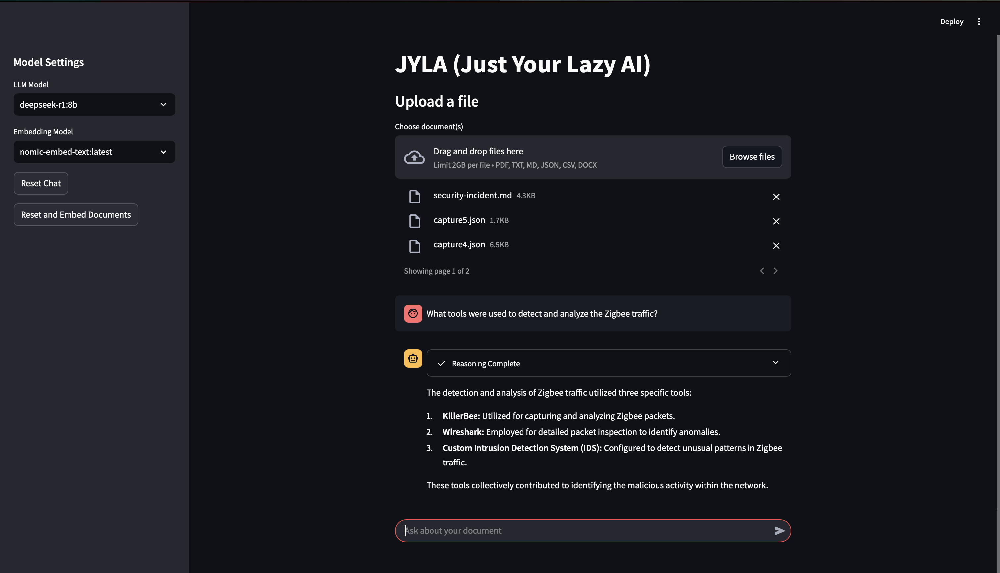

# JYLA (Just Your Lazy AI)

**JYLA** is a Streamlit application designed to facilitate interaction with documents through an AI chatbot. It supports various document types including PDF, DOCX, JSON, CSV, Markdown, and plain text, allowing users to ask questions about the document's content.



## Features

- **Document Processing**: Supports multiple file formats for document upload.
- **Chatbot Interface**: Users can ask questions about the document content.
- **Model Selection**: Allows selection of different Ollama models for both language processing and embeddings.
- **Session Management**: Keeps track of chat history and document processing state.

## Setup

### Prerequisites

- Python 3.8+
- Streamlit
- PyMuPDF (fitz)
- langchain libraries
- Ollama server running on `localhost:11434`

### Installation

**Create a python3 virtual environment**:

*For MacOS/Linux:*

```
python3 -m venv venv
source ./venv/bin/activate
```

*For Windows*

```
python -m venv venv
.\venv\Scripts\activate
```

**Install Python Packages**:
   ```
   pip install -r requirements.txt
   ```

After installing all the required libraries, we recommend you **restart your python3 virtual environment**.

*For MacOS/Linux:*
```
deactivate
source ./venv/bin/activate
```

*For Windows*

```
deactivate
.\venv\Scripts\activate
```

**Ensure Ollama Server is Running**:
   - Download and install Ollama from [Ollama's official site](https://ollama.ai/).
   - Start the Ollama server:
```
ollama serve
```

For embeddings, we recommend downloading nomic-embed-text and for the LLM model, we recommend llama3.2 or deepseek-r1:8b

```
ollama pull llama3.2
ollama pull deepseek-r1:8b
```


**Run the Application**:
```
streamlit run your_script_name.py
```

## Usage

1. **Upload a Document**: Use the file uploader to select and upload your document.

2. **Select Models**: From the sidebar, choose the LLM and embedding models you wish to use.

3. **Chat with the Document**: 
   - Type your question in the chat input box.
   - JYLA will respond based on the document's content.

4. **Reset Chat**: Use the reset button in the sidebar to clear the chat history and unload the current document.


## Configuring File Upload Size

This project uses Streamlit for its user interface, which by default limits file uploads to 200MB. However, we've configured the app to allow for larger file uploads (up to 2GB). Here's how you can adjust this setting:

- **.streamlit Folder**: This folder contains configuration files for Streamlit. It's hidden by default due to the dot prefix.

- **config.toml**: This file contains settings for the Streamlit server. Here's what you'll find:

```
[server]
maxUploadSize = 2048  # This sets the maximum upload size to 2GB (2048 MB)
```

To change the maximum file size for uploads:

1. **Locate the Configuration File**: Navigate to the `.streamlit` folder in your project directory.

2. **Edit `config.toml`**: Open the `config.toml` file with a text editor.

3. **Modify `maxUploadSize`**:
   - The `maxUploadSize` value is in megabytes (MB). 
   - To increase the limit, change the number to your desired size in MB. For example, to set it to 5GB, you would use `maxUploadSize = 5120`.

4. **Save and Restart**: Save the file and restart your Streamlit app for the changes to take effect.

**Important Notes:**

- **Memory Usage**: Be cautious when setting a very high limit as files are stored in the browser's memory. Large files might cause performance issues or crashes.

- **Deployment**: If you're deploying this app, ensure that the `.streamlit/config.toml` file is included in your deployment package. For Streamlit Community Cloud, this means including it in your GitHub repository.

- **Testing**: After changing the configuration, test your app locally and on the deployment platform to ensure the new upload size limit works as expected.

By adjusting this setting, you can tailor the file upload capabilities of this project to meet your specific needs.


## Project Notes

- Ensure that the Ollama server is accessible at `localhost:11434`. If running on a different port or host, adjust the `requests.get` URL in `get_ollama_models()`.
- The application uses session state to manage document processing and chat history, which persists across reruns of the Streamlit app.

## Troubleshooting and FAQ

- **Model Not Found**: If no models are listed, check if the Ollama server is running and accessible.
- **File Processing Errors**: Ensure the file types are supported and the files are not corrupted.

## License

This project is open-sourced under the MIT license. See the LICENSE file for more details.
